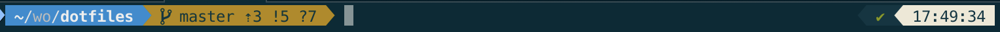
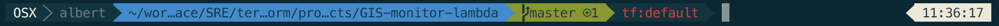

# Albert Vila's Dotfiles

This is a collection of dotfiles and scripts I use for customizing OS X/Linux to my liking and setting up the software development tools I use on a day-to-day basis. It can be cloned anywhere. It includes a setup script that creates the symlinks from your home directory to the cloned repository.

The setup script is smart enough to back up your existing dotfiles into a `~/.dotfiles_old/` directory if you already have any dotfiles.

I prefer `zsh` as my shell of choice. As such, the setup script will install `prezto` and `zsh`. If `zsh` is installed, and it is not already configured as the default shell, the setup script will execute a `chsh -s $(which zsh)` command. This changes the default shell to zsh, and takes effect as soon as a new zsh is spawned or on next login.

Check `config.sh` file if you want to know all packages/modules to install and the `lib/osx.sh` to know the osx defaults that will be changed. Vim plugins are located in `vim/plugins.vim`.

Recap
- Setup dotfiles (Note that the first time you ran the setup script it may throw some vim errors, just run the script twice)
- Install osx dev packages for brew/pip/atom and osx defaults
- Install prezto & zsh as shell (https://github.com/sorin-ionescu/prezto)
- Shell theme powerlevel9k (https://github.com/bhilburn/powerlevel9k)
- Colors theme solarized (iterm2, vim, intellij) (http://ethanschoonover.com/solarized)
- Fonts powerline (https://github.com/powerline/fonts)

The customized theme looks like


And with terraform default workspace looks link


## Installation

Before installing make sure you have the `git` command. If not, just open a `Terminal` and install the command line tools by typing `xcode-select --install`

```sh
$ git clone https://github.com/albert.vila/dotfiles.git ~/dotfiles
$ cd ~/dotfiles
$ git submodule init
$ git submodule update
$ sh ./setup.sh
```

## Update
Just run `./setup.sh` from time to time to automatically update all modules and applications

### issues
- Permission issues with homebrew under OS X El Capitan. Check /usr/local folder if it has de right permissions. Maybe you need to run
```sudo chown $(whoami):admin /usr/local && sudo chown -R $(whoami):admin /usr/local```

- If you get the error `xcrun: error: invalid active developer path (/Library/Developer/CommandLineTools), missing xcrun at: /Library/Developer/CommandLineTools/usr/bin/xcrun` on OS X High Sierra then you need to reinstall the xcode tools. Run `xcode-select --install` and the errors will disappear

- If you get the error `Undefined subroutine &ExtUtils::ParseXS::errors` when updating vim, you should change the plenv global version to use the system one, update vim, and then get back to the needed perl version
```
  plenv global system
  ./setup.sh
  plenv global 5.14.2
```

- Permission issues with pip, run the following command `sudo easy_install pip`

- If you get the following error `zsh:1: command not found: pygmentize` doing a cat or more, just run the following command `sudo easy_install Pygments`

## Manual steps after first setup

### general
1. Open OSX mouse settings and select Natural scroll on trackpad (already present on the `setup_osx` function from `./lib/osx.sh`, pending to check if it works)
2. Open OSX keyboard settings and remove spotlight shortcut
3. Open Alfred and set spotlight shortcut, also select to be opened at login
4. Open spectacle and select to be opened at login

### iterm2
1. Open iTerm2's preferences (do this change for all needed profiles).
2. Go to colors, load presets and select Solarized Dark. Make sure that the minimum contrast slider is set to low
3. Click on text, make sure that "Draw bold text in bright colours" is disabled
4. Change the font to Meslo LG M Regular for Powerline, 12p
5. Go to Global Keys tab and change mapping for Ctrl+Tab / Ctrl+Shift+Tab to Next and Previous tab
6. Add two more mappings to jump at the beginning/end of line
```
    FOR  ACTION         SEND
    ⌘←  "HEX CODE"      0x01
    ⌘→  "HEX CODE"      0x05
```
7. Follow https://wakatime.com/terminal instructions to enable wakatime in iterm2

### intellij
1. Clone git repository
```sh
$ git clone git@github.com:jkaving/intellij-colors-solarized.git
```
2. Go to `File | Import Settings...` and specify the `intellij-colors-solarized` directory
 Click `OK` in the dialog that appears.
3. Restart IntelliJ IDEA
4. Go to `Preferences | Editor | Colors & Fonts` and select one of the new color themes.
5. Check `Preferences > Editor > General > Ensure line feed at file end on save`
6. UnCheck `Preferences > Editor > Code Style > Java > Code Generation > Line comment at first column`
7. Check `Preferences > Editor > Code Style > Java > Code Generation > Add a space at comment start`
8. Check `Preferences > Editor > Code Style > Wrap on typing` on Right margin option
9. Update `Editor > Code Style > Java > Imports tab set Class count to use import with '*'` and `Names count to use static import with '*'` to 999
10. Install the following Plugins
- ChecksStyle-IDEA
- Lombok

### jenv
https://gist.github.com/branneman/3d2658bf5586029878e47557e544b4b6
https://www.linkedin.com/pulse/manage-multiple-java-mac-os-x-dinesh-prajapati/

### plenv
Once you know that perl version to install, run the following commands
1. plenv install $version
2. plenv rehash
3. plenv global $version
4. plenv install-cpanm
5. You may need to restart your terminal, just type perl --version to be sure you are running the desired version

### awscli
- Run `awscli configure` and set up your aws credentials

### atom
- Open Highlight Selected package settings and unselect `Only Highlight Whole Words`
- Open Linter-perl settings and add ., lib, conf to the Inc Paths from Project Root

### alfred workflows
- SSH: Follow steps to use iterm2 instead of Terminal (https://github.com/deanishe/alfred-ssh)

## External links

iTerm and zsh tips
- <https://www.undefinednull.com/2015/07/31/iterm-tips-and-zsh-plugins-for-better-development-environment/>
- <http://reasoniamhere.com/2014/01/11/outrageously-useful-tips-to-master-your-z-shell/>

## Future ToDo
- Create a --force flag that removes the ~/.dotfiles and then continues with the setup
- Be able to install npm modules https://www.leeboonstra.com/developer/mac-osx-how-to-install-jshint-to-the-commandline-sublime-text-with-node/
-   npm install -g aws-sam-local
-   npm install --global alfred-goodreads-workflow
- Check the chequegourmet page every day and send a notification with the pending amount (osascript -e 'display notification "Hello world!" with title "Hi!" sound name "default"')
- Check to avoid running ./setup.sh if git submodules are not present
- Perl alfred workflow example -> https://github.com/2shortplanks/alfred-metacpan
