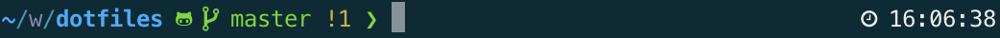

 # Albert Vila's Dotfiles

This is a collection of dotfiles and scripts I use for customizing OS X to my liking and setting up the software development tools I use on a day-to-day basis. It can be cloned anywhere. It includes a setup script that creates the symlinks from your home directory to the cloned repository.

The setup script is smart enough to back up your existing dotfiles into a `~/.dotfiles_old/` directory if you already have any dotfiles.

I prefer `zsh` as my shell of choice. As such, the setup script will install `prezto` and `zsh`. If `zsh` is installed, and it is not already configured as the default shell, the setup script will execute a `chsh -s $(which zsh)` command. This changes the default shell to zsh, and takes effect as soon as a new zsh is spawned or on next login.

Check `config.sh` file if you want to know all packages/modules to install and the `lib/os.sh` to know the osx defaults that will be changed. Vim plugins are located in `vim/plugins.vim`.

The `config.sh` file contains the default packages/modules, it can be extend with a custom file per user, for example I also use the `config_albert.sh` file.

Recap
- Setup dotfiles (Note that the first time you ran the setup script it may throw some errors, just run the script twice)
- Install osx dev packages for brew/pip/npm/gem/yarn/vscode/brew cask and osx defaults
- Install prezto & zsh as shell (https://github.com/sorin-ionescu/prezto)
- Shell theme powerlevel10k (https://github.com/romkatv/powerlevel10k)
- Colors theme solarized (iterm2, gnome-terminal, vim, intellij) (http://ethanschoonover.com/solarized)
- Fonts powerline (https://github.com/powerline/fonts)

The customized theme looks like


If you would like to change the theme just run `p10k configure`

## Installation
Before installing under OSX make sure you have the `git` command installed. If not, just open a `Terminal` and install the command line tools by typing `xcode-select --install`.

```sh
$ git clone https://github.com/albertvila/dotfiles.git ~/dotfiles
$ cd ~/dotfiles
$ sh ./setup.sh
```

If you have a custom file like `config_XXX.sh` then you should use the `./setup -uXXX` command, it will install the default and the custom packages/modules.

## Update
Just run `./setup.sh` from time to time to automatically update all modules and applications. Use the `-f` option to avoid being asked for a confirmation.

## Manual steps

### general
1. Open OSX keyboard settings and remove spotlight shortcut
2. Open Alfred and set spotlight shortcut, also select to be opened at login
3. Open rectangle and select to be opened at login

### github
1. Generate a new GPG key & add it to Github.com
2. Generate a new SSH key & add it to Github.com
3. Register the new SSH key using `ssh-add ~/.ssh/github`

### jenv
1. Execute `/usr/libexec/java_home -V` to know all java versions installed on your computer
2. `jenv add ...` to add them
3. `jenv global ...` to set up the version you want to use

More information [here](https://www.linkedin.com/pulse/manage-multiple-java-mac-os-x-dinesh-prajapati/)

If the first command does not return anything, just run `brew info java` and `brew info java11` and execute the symlink for the sytem Java wrappers

### iterm with powerlevel10k
1. Install the Nerd fonts (https://github.com/romkatv/powerlevel10k#fonts)

## Possible issues

- Issues signing commits with Github. First follow all steps from here https://sabbour.me/setting-up-signed-git-commits-on-macos/
If the problem still persist, enable the git Trace mode to properly see the error using
```export GIT_TRACE=1```

- If you get issues with gpg, first check the current key is not expired using `gpg --list-secret`. If expired, you can change the expiratoin time using `gpg --edit-key XXX` and then using the `expire` command within the shell.
Also be sure the variable `export GPG_TTY=$(tty)` is properly set, more information [here](https://www.gnupg.org/(it)/documentation/manuals/gnupg/Common-Problems.html)

- If some Alfred workflows does not work it may be because they need the `php` command.

## Chrome extensions
> Automatically sync

- AdBlock plus
- Bear Chrome
- Dark Reader
- GIFs for Github
- Google Docs Offline
- I don't care about cookies
- JSON Formatter
- Keepa - Amazon Price Tracker
- Pushbullet
- Refined GitHub
- Tampermonkey

## Manual steps after first setup

### aws
- Run `aws configure` and set up your aws credentials

### Google drive
- If the Strikethrough shortcut does not work, review if it's used by a Chrome extension using `chrome://extensions/shortcuts`

### Tampermonkey for Chrome
- Open the extension settings, export to a file and then import to the new computer

### Github
- You need to configure your gitconfig user section, to do so just create a file named `~/.gitconfig-user` in your home folder with the following properties:

```
[user]
	name = Github User
	email = github@email.com
	signingkey = XXX
```

Replace:
- `Github User` with your name and surname
- `github@email.com` with the email used to login into github
- `XXX` with the signing key id

- The ~/.gitconfig-lm file contains company specific hooks, so you can skip this if you want, or add your own hooks.

```
[core]
	hooksPath = __PATH_TO_YOUR_HOOKS__/git-hooks
```

## Old issues
- Permission issues with homebrew under OS X El Capitan. Check /usr/local folder if it has de right permissions. Maybe you need to run
```sudo chown $(whoami):admin /usr/local && sudo chown -R $(whoami):admin /usr/local```

- If you get the error `xcrun: error: invalid active developer path (/Library/Developer/CommandLineTools), missing xcrun at: /Library/Developer/CommandLineTools/usr/bin/xcrun` on OS X High Sierra then you need to reinstall the xcode tools. Run `xcode-select --install` and the errors will disappear

- If you find the following error while updating homebrew apps, then you should remove one of the taps. You can see all of them using `brew tap` and remove one using `brew untap XXX`

```
Error: Cask java8 exists in multiple taps:
  homebrew/cask-versions/java8
  caskroom/versions/java8
```

- To fix the following issue `nvm is not compatible with the npm config "prefix"` just run the following commands with the node version displayed from the output of the first command

```
npm config delete prefix
npm config set prefix $NVM_DIR/versions/node/v6.13.7
```

- If you get any error related to `pygmentize` doing a cat or more, just run the following command `sudo easy_install Pygments` to see if it solves the issue

## External links

iTerm and zsh tips
- <https://www.undefinednull.com/2015/07/31/iterm-tips-and-zsh-plugins-for-better-development-environment/>
- <http://reasoniamhere.com/2014/01/11/outrageously-useful-tips-to-master-your-z-shell/>
